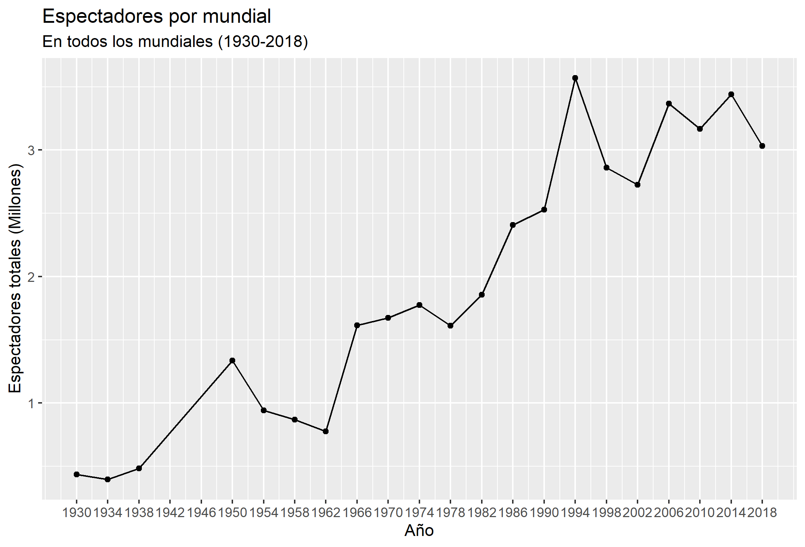
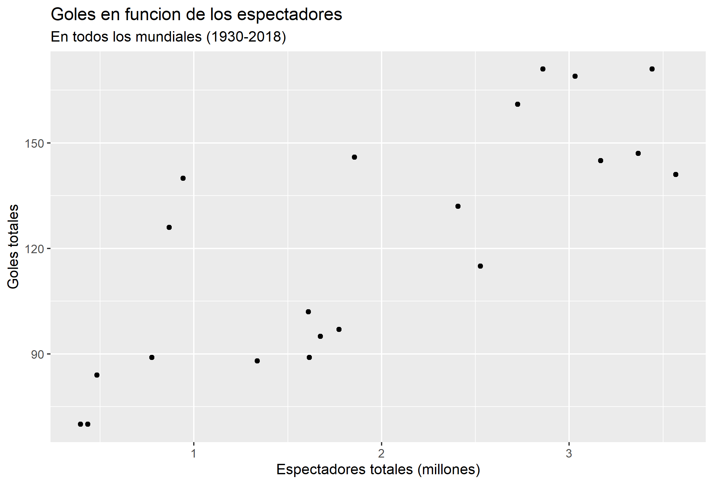
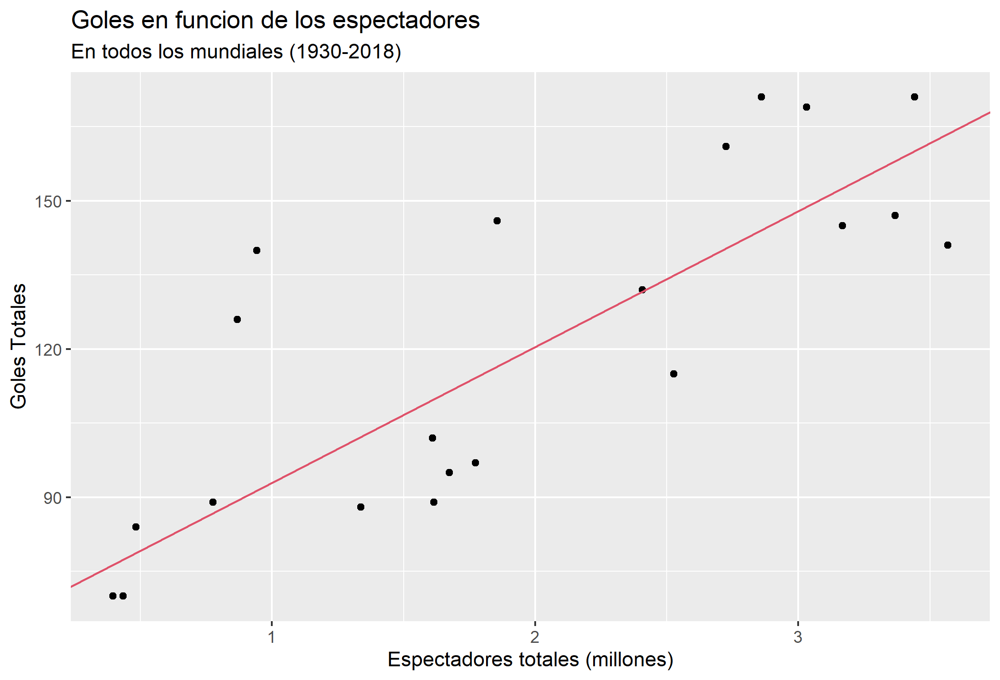

```{r setup, include=FALSE}
knitr::opts_chunk$set(echo = TRUE)
```

## Introduccion

La copa mundial de la fifa es el torneo más importante del futbol profesional. En el se enfrentan las mejores selecciones de cada continente con el proposito de alcanzar este ansiado trofeo. Este torneo se realiza cada cuatro años en una sede única, y consta de una fase de grupos, en la que se enfrentan cuatro paises y clasifican los dos primeros, una fase de eliminacion directa (octavos de final, cuartos de final, semifinal y la final), en la cual cada etapa consta de un partido unico y el equipo vencedor avanzara a la siguiente.

Este torneo no solo es el más importante a nivel de futbol, sino que tambien a nivel deportivo, asi lo menciona wikipedia en su descripcion del mundial, cito : "La fase final del torneo es el evento deportivo de una sola disciplina más importante del mundo (la final de la Copa Mundial de Fútbol de 2002 fue vista por más de 1100 millones de personas), y el segundo más importante a nivel general después de los Juegos Olímpicos.".
Asi lo indican las estadisticas de audiencia, en las cuales destaca con numeros sorprendentes sobre todas las otras diciplinas deportivas. 

Para cada mundial, hinchas de todos los paises viajan al país anfitrion con el deseo de poder ver y apoyar a su seleccion, cumpliendo un rol fundamental en el desarrollo del partido, ya que al alentar dejan de ser unicamente espectadores y se conviertenen en una motivacion extra para sus jugadores. Y asi lo reconocen los entrenadores, jugadores y periodistas, ya que la energia que transmiten las hinchadas (con sus gritos, canticos, banderas, etc) para ellos es inigualable.

Asi lo señala el diario "El Pais", rescatando los dichos de Marcelo Bielsa (actual entrenador del Leeds de la 1ra division inglesa), cito: “Debería existir una regla por la cual la entrada de aficionados en los estadios se produjera en todos o en ninguno. La presencia de hinchas en las gradas tiene incidencia en los resultados y los clubes ubicados en zonas de alta incidencia estarían penalizados”. Refiriendose a la decision del gobierno britanico sobre la vuelta a los estadios del publico.

El proposito de este informe es analizar que tipo de  impacto generan los espectadores en la copa mundial de futbol, ¿Es verdad la afirmacion que realizan los futbolistas acerca de las fanaticadas? Para logar desarrollar este analisis contamos con informacion sobre la cantidad de espectadores y cantidad de goles de cada uno de los mundiales desde su primera edicion en 1930, hasta la ultima, la cual se llevo a cabo en 2018. 

El informe se dividira en tres partes. En primer lugar analizaremos a profunidad todos los datos, comparando la audiencia desde los primeros mundiales hasta la actualidad y  analogamente haremos el mismo analisis sobre la cantidad de goles. En segundo lugar veremos si es posible explicar los goles de los mundiales en base a la cantidad espectadores, y si esta explicacion, a su vez, coincide con nuestra premisa, la cual es, que la aficion afecta positivamente en el numero de goles realizados. Finalmente concluiremos nuestro informe comentando los resultados, todo esto sustentado y respaldado por un modelo matematico.

## Desarrollo

Como mencione en la introduccion, el proposito de este informe es analizar que tipo de  impacto generan los espectadores en la copa mundial de futbol. Para lo cual recopile informacion desde el primer mundial hasta el ultimo sobre los goles y los espectadores que cada uno tuvo.

```{r, include=FALSE}
require(tidyverse)

espectadores_datos = read_delim("../datos/espectadores.csv")

goles_datos = read_delim("../datos/goles.csv")

AsisTotal = espectadores_datos$`Asistencia total`

goles = goles_datos$Goles
```

Primero observaremos la evolucion de los espectadores a traves de los mundiales.


Podemos observar que ha medida que avanzaron los mundiales, mayor fue la cantidad de publico que estos tuvieron, puesto que los datos siguen una tendencia creciente. Pudiendo ser atribuido a la mejora economica de la poblacion mundial, a la masificacion del futbol, etc.


A continuacion observaremos la evolucion de los goles a traves de los mundiales.


Podemos observar que ha medida que avanzaron los mundiales, mayor fue la cantidad de goles que se realizaron, puesto que los datos siguen una tendencia creciente. Pudiendo ser atribuido a la evolucion tactica y tecnica del deporte, la cantidad de publico en el estadio, etc.

Para saber si sera posible explicar los goles realizados por mundial en funcion de los espectadores que tuvo este mismo, visualizaremos un grafico de dispersion entre estas variables.



Como podemos notar existe una tendencia creciente entre los goles realizados por mundial y los espectadores que tuvo el mundial, por lo que es probable que estas dos variables tengan una correlacion positiva.

Verificaremos su correlacion.

```{r}
cor(AsisTotal,goles)

```

Como podemos ver la correlacion entre los goles realizados por mundial y los espectadores que tuvo el mundial
es positva y ademas alta, por lo que sera posible generar una recta de regresion que me permita explicar los goles realizados en un mundial a traves del publico total de dicho mundial.

```{r}

regresion = lm(goles ~ AsisTotal)
summary(regresion)

```

Podemos ver que tanto el intercepto como la recta de regresion son significativos para este modelo,
por ende, existe una recta que sera capaz de explicar los goles en funcion de la asistencia (de cada mundial).

Visualizaremos el grafico de dispersion junto con la recta de la regresion.



Podemos notar que la recta de regresion se ajusta correctamente a nuestros datos, permitiendonos corroborar nuestro objetivo.

## Conclusion

Son muchas las personas dedicadas al futbol que hablan del publico en los estadios como un apoyo fundamental, que se convierten en un jugador mas para el equipo, etc., lo que para la gran mayoria puede sonar a palabras de buena crianza o simplemente populismo. Pero estas palabras no son solo dichos, son una realidad.

Gracias a los datos recopilados y las herramientas previamente utilizadas, pudimos corroborar esta premisa en base a desarrollo matematico (regresion lineal), permitiendonos concluir que el apoyo de la gente en los estadios ayuda a las selecciones nacionales a realizar mas goles durante un partido (del mundial), en otras palabras, a medida que mayor sea la cantidad de espectadores que posea un mundial, mayor sera la cantidad de goles realizados en el.

## Bibliografia
 
Wikipedia: https://es.wikipedia.org/wiki/Copa_Mundial_de_Fútbol#cite_note-2002coverage-2

El Pais: https://elpais.com/deportes/2021-01-05/cuanto-juega-el-publico-en-un-partido-de-futbol.html