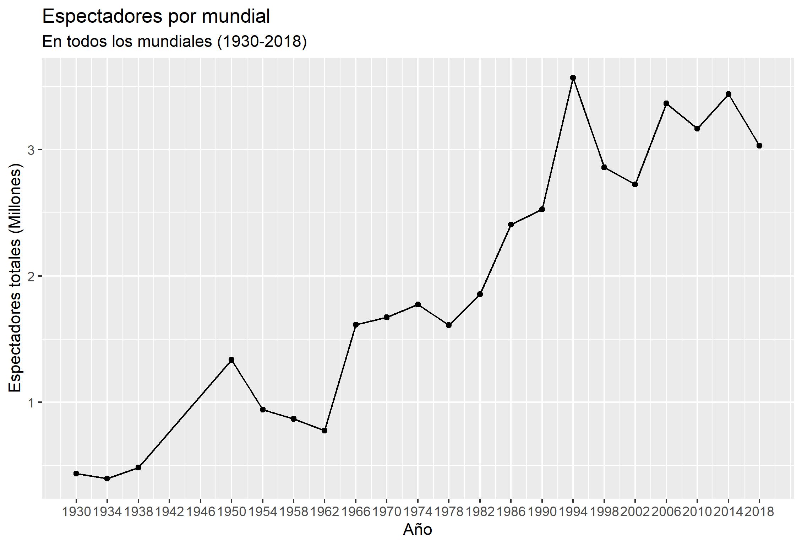
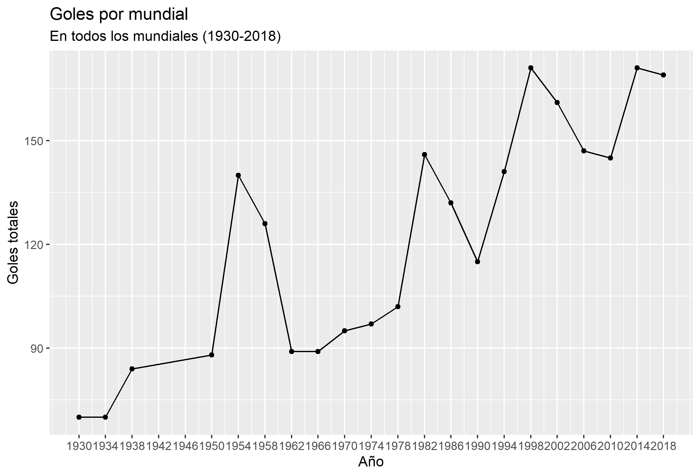
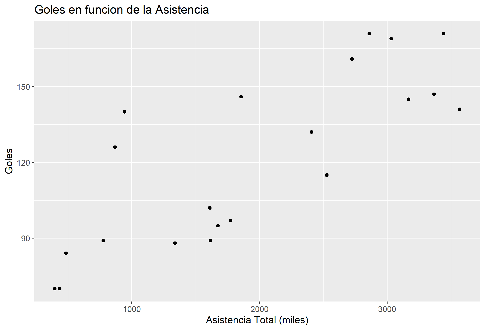
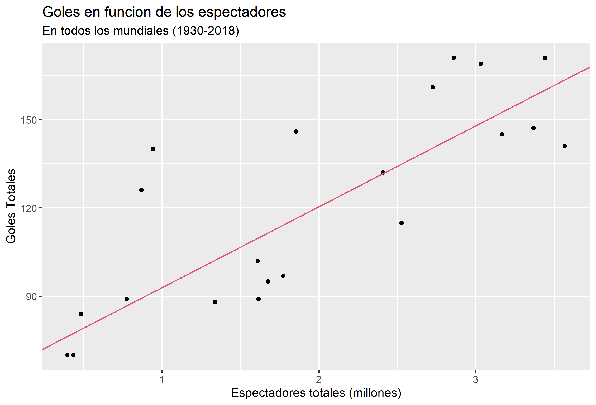

```{r setup, include=FALSE}
knitr::opts_chunk$set(echo = TRUE)
```

## Introducción

La copa mundial de la FIFA no solo es el más importante a nivel de futbol, sino que tambien a nivel deportivo. Asi lo señala Libros aguilar, "La copa del mundo es uno de los eventos deportivos más vistos en todo el planeta. Incluso, por encima de los juegos olímpicos. También tiene mucha influencia propagandista e impacto cultural. Los países que participan en la copa mundial lo consideran de gran importancia."

Para cada mundial, hinchas de todos los paises viajan al país anfitrion con el deseo de poder ver y apoyar a su seleccion, cumpliendo un rol fundamental en el desarrollo del partido, ya que al alentar dejan de ser unicamente espectadores y se conviertenen en una motivacion extra para sus jugadores. Y asi lo reconocen los entrenadores, jugadores y periodistas, ya que la energia que transmiten las hinchadas (con sus gritos, canticos, banderas, etc) para ellos es inigualable.

El propósito de este informe es analizar cual es el impacto generan los espectadores en la copa mundial de futból, ¿Es verdad la afirmación que realizan los futbolistas acerca de las fanaticadas? Para logar desarrollar este analisis contamos con información sobre la cantidad de espectadores y cantidad de goles de cada uno de los mundiales desde su primera edición en 1930, hasta la última, la cual se llevo a cabo en 2018. 

El informe se dividirá en tres partes. En primer lugar compararemos la audiencia desde los primeros mundiales hasta la actualidad y analogamente sobre la cantidad de goles. En segundo lugar veremos si es posible explicar los goles de los mundiales en base a la cantidad espectadores. Finalmente concluiremos nuestro informe comentando los resultados, todo esto sustentado y respaldado por un modelo matemático.

## Antecedentes

La copa mundial de la FIFA es el torneo más importante del fútbol profesional. Este torneo se realiza cada cuatro años en una sede única. Para poder clasificar a esta competición selecciones de todo el mundo deben competir con países de su mismo continente para obtener cupos de clasificación (distintos continentes poseen distinta cantidad de cupos). Cuando un país clasifica al mundial accede a la fase de grupos, en la cual tendra que enfrentarse con tres selecciones, clasificando a la siguiente fase los dos primeros de cada grupo. Posteriormente los países clasificaran a la fase final del torneo (octavos de final, cuartos de final, semifinal y la final), en la cual cada etapa consta de un partido único y el equipo vencedor avanza a la siguiente. El país que logre vencer en la final será el campeón del mundo.

## Datos
```{r, include=FALSE}
require(tidyverse)
require(gt)

espectadores_datos = read.csv("../datos/espectadores.csv")

goles_datos = read.csv("../datos/goles.csv")

espectadores_original = espectadores_datos

espectadores_original$Cantidad.partidos = NULL
espectadores_original$año = NULL

goles_original = goles_datos
goles_original$Cantidad.partidos = NULL
goles_original$año = NULL
goles_original$Goles.por.partido = NULL


goles = goles_datos$Goles
AsisTotal = espectadores_datos$Asistencia.total

```
Para lograr el desarrollo del informe, rescaté informacion de la FIFA acerca de:

1.Número de goles marcados en los Mundiales de Fútbol desde 1930 hasta 2018.

CSV compuesto por:

a. **Sede**: Contiene al país sede junto al año en que se realizó el torneo.
b. **Goles**: Contiene los goles totales realizados en esa edición del torneo.

Se completo la información del csv con las columnas:

a. **Cantidad partidos**: Contiene la cantidad de partidos de esa edición del torneo.
b. **Goles por partido**: Contiene los goles por partido (Goles / Cantidad de partidos) realizados en esa edición del torneo.
c. **año**: Contiene el año en que se realizo el torneo.

obteniendo la siguiente tabla:
```{r, echo=FALSE,message=FALSE}

gt(goles_datos)


```

2.Número de espectadores en las ediciones de la Copa Mundial de fútbol desde 1930 hasta 2018.

CSV compuesto por:

a. **Sede**: Contiene al país sede junto al año en que se realizó el torneo.
b. **Asistencia total**: Contiene la asistencia total a esa edición del torneo.
c. **Media de asistencia por partido**: Contiene la asistencia por partido (Asistencia Total / Cantidad de partidos) de esa edición del torneo.

Se completo la información del csv con las columnas:

a. **Cantidad partidos**: Contiene la cantidad de partidos de esa edición del torneo.
b. **año**: Contiene el año en que se realizó el torneo.

obteniendo la siguiente tabla:
```{r, echo=FALSE,message=FALSE}

gt(espectadores_datos)


```

## Desarrollo

Como mencioné en la introducción, el proposito de este informe es analizar cual es el impacto(si existe) generan los espectadores en la copa mundial de futbol. Para lo cual trabajaremos la información descrita anteriormente.

A continuación bservaremos la evolución del numero de espectadores por mundial a traves del tiempo.


Podemos ver que ha medida que avanza el tiempo, es mayor la cantidad de público que los mundiales tienen, puesto que los datos siguen una tendencia creciente. Esto podría ser atribuido a la mejora económica de la población mundial, a la masificación del fútbol, etc.

Se puede apreciar distintos 'peaks' de espectadores en los años 1950,1966-1974,1994 (Brasil, Inglaterra, México, Alemania y Estados Unidos respectivamente). Los cuales pueden ser atribuidos al desarrollo economico y turístico del país sede (en comparación con los países anfitriones de otros mundiales).   


A continuación observaremos la evolucion de la cantidad de goles realizados por mundial a traves del tiempo.


Podemos observar que ha medida que avanza el tiempo, es mayor la cantidad de goles que en los mundiales se realizaron, puesto que los datos siguen una tendencia creciente. Estó podría ser atribuido a la evolucion tactica y tecnica del deporte, la cantidad de publico en el estadio, etc.

Se puede apreciar distintos 'peaks' de espectadores en los años 1954,1982-1998 (Suiza, España y Francia respectivamente). Los cuales pueden ser atribuidos a que dicho mundial aumento la cantidad de partidos respecto al mundial anterior. El caso del mundial de Suiza 1954 es diferente puesto que aumento solo 3 partidos respecto al mundial de Brasil 1950 y la diferencia de goles entre ambos mundiales es de 52. Por lo que es posible que exista otro factor capaz de explicar esa diferencia, como una evolucion tecnica o táctica a nivel del futbol mundial, la presencia de mayor cantidad de selecciones destacadas en el futbol ofensivo, selecciones más efectivas de cara a la porteria (necesitaban realizar menos tiros al arco para anotar), etc.. Cabe destacar que el mundial de Suiza 1954 fue el mundial con mayor cantidad de goles por partido `r goles_datos[goles_datos$Sede == 'Suiza 1954',]$Goles.por.partido `.

Como se señaló en la introducción, en este informe se busca analizar cual es el impacto que generan los espectadores en la copa mundial de futból.

En primer lugar visualizaremos el grafico de dispersion entre la cantidad de espectadores y goles por mundial.



Observando el grafico podemos evidenciar que existe una tendencia creciente entre los goles realizados por mundial y los espectadores que este tuvo, por lo que es probable que estas dos variables tengan una correlación positiva.

Para verificar lo concluido en el parrafo anterior se aplicó una prueba de correlación entre estas dos variables obteniendo `r cor(AsisTotal,goles) `, que es positva y ademas alta, por lo que sera posible generar una recta de regresion que me permita explicar los goles realizados en un mundial a traves del publico total de dicho mundial.

```{r, include=FALSE}

regresion = lm(goles[-c(17)] ~ AsisTotal[-c(17)])
summary(regresion)$coefficients

tabla_estimadores <- data.frame(
  "Parametros" = c('Intercepto','Pendiente'),
  "Valores estimados" = summary(regresion)$coefficients[1:2], 
  "Errores estandar" = summary(regresion)$coefficients[3:4], 
  "Valor t" = summary(regresion)$coefficients[5:6]
)
```

```{r}
gt(tabla_estimadores)
```

Podemos ver que tanto el intercepto como la recta de regresion son significativos para este modelo,
por ende, existe una recta que sera capaz de explicar los goles en funcion de la asistencia de cada mundial.

Visualizaremos el grafico de dispersion junto con la recta de la regresion.



En la figura anterior se puede observar que la recta de regresión se ajusta correctamente a nuestros datos, permitiendonos corroborar nuestro objetivo.

## Conclusion

En este informe visualizamos la evolucion de la cantidad de goles y la cantidad de espectadores por mundial a trabes del tiempo, notando que con el paso del tiempo ambos conteos han ido en aumento. Posteriormente realizamos un grafico de dispersión entre estas dos variables donde notamos que existe una correlación entre estasa. Por ultimo realizamos la regresión, la cual fue significativa.

Son muchas las personas dedicadas al fútbol que hablan del público en los estadios como un apoyo fundamental, que se convierten en un jugador más para el equipo, etc., lo que para la gran mayoría puede sonar a palabras de buena crianza o simplemente populismo. Pero estas palabras no son solo dichos, son una realidad.

Gracias a los datos recopilados y las herramientas previamente utilizadas, pudimos corroborar esta premisa en base a desarrollo matemático (regresion lineal), permitiendonos concluir que el apoyo de la gente en los estadios ayuda a las selecciones nacionales a realizar mas goles durante un partido del mundial, en otras palabras, a medida que mayor sea la cantidad de espectadores que posea un mundial, mayor sera la cantidad de goles realizados en él.

Si bien el apoyo del público es un elemento importante a nivel futbolístico no es el único, existen otros factores capaces de afectar el desarrollo de un partido, como el estado anímico de un futbolista, el nivel de infrestructura futbolistica del equipo, el nivel tactico del equipo, el nivel tecnico individual, etc. Factores los cuales en complemento con el apoyo del publico, pueden permitirnos obtener un mejor analisis sobre que tan importante es este ultimo en comparación al resto de elementos mencionados anteriormente.


## Referencias
 
Libros Aguilar. (21 de agosto de 2021). Re: https://librosaguilar.com/los-mejores-eventos-deportivos-del-mundo/

Número de espectadores en las ediciones de la Copa Mundial de fútbol desde 1930 hasta 2018, FIFA,  https://es.statista.com/estadisticas/635341/numero-de-espectadores-en-las-ediciones-de-la-copa-mundial-de-futbol-1930/

Número de goles marcados en los Mundiales de Fútbol desde 1930 hasta 2018, FIFA,
https://es.statista.com/estadisticas/504347/evolucion-de-los-goles-marcados-en-los-mundiales-de-futbol/

Copa Mundial » Estadísticas » Goles por temporada, livefutbol.com, https://www.livefutbol.com/estadistica/wm/1/
